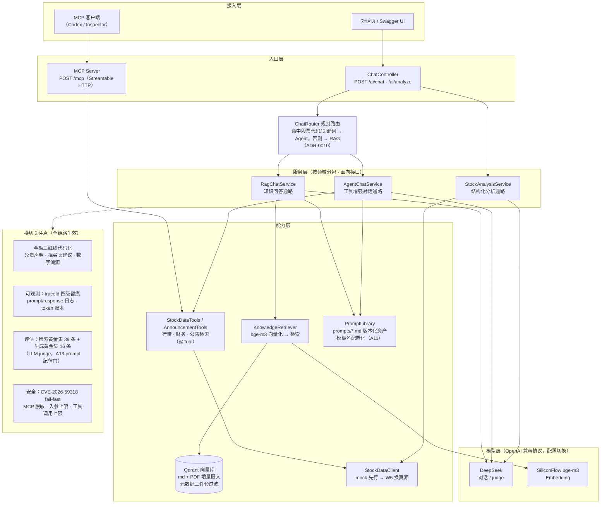

# ai-evolution

> Java 架构师 → AI 应用架构师的实战演化项目：一个仓库贯穿 27 周，
> 从 `/ai/chat` 起步，到带护栏、可评估、走协议的生产形态 Agent 系统。

## 为什么做这个项目

- **干净的实验田**：从零搭建，每个技术选型都是显式决策，每个架构决策都能在 ADR 里讲出 why
- **项目制学习**：对照《Agent 工程化实战路线》课程地图，动手 > 阅读，每周有可演示产出物
- **可求职的作品集**：成品代码 + 架构图 + eval 报告三位一体

**业务域：金融个股研究**。选它不是偶然——金融合规约束（红线）是 Harness 工程最好的教材，
历史事实题天然适合建评估黄金集，研究循环天然是 Agent Loop。

### 三条设计红线（写进代码，全项目生效）

1. **免责声明强制附带**：所有输出末尾自动追加「不构成投资建议」
2. **禁止具体买卖建议**：拒答"该不该买/目标价多少"，引导回结构化事实与观点对照
3. **数字必须可溯源**：数据源 + 时点必带，模型不许凭记忆报数

## 技术选型

| 领域 | 选型 | 决策记录 |
|---|---|---|
| 语言 / 框架 | Java 25 (LTS) / Spring Boot 4.1.1 | [ADR-0001](docs/adr/0001-foundation-and-stack.md) |
| AI 编排 | Spring AI 2.0.1 | ADR-0001 |
| 模型供应商 | DeepSeek（对话）+ SiliconFlow bge-m3（Embedding，OpenAI 兼容协议） | [模型选型笔记 v1](docs/model-selection-v1.md)（双模型实测） |
| 向量数据库 | Qdrant v1.15.1 | W3 落地 |
| 镜像构建 | Jib | [ADR-0002](docs/adr/0002-image-build-with-jib.md) |
| 部署 | Kubernetes（本地 Minikube）——云原生第一天 | W2 落地 |
| 接口文档 | springdoc OpenAPI 3（本地开 UI / 集群关 UI，约定 A7） | W2 落地 |

## 快速上手

```bash
# 前置：.env 配置 AI_API_KEY / SILICONFLOW_API_KEY；本地 Qdrant 容器
docker run -d --name qdrant -p 6333:6333 -p 6334:6334 qdrant/qdrant:v1.15.1

# 本地运行（对话页 http://localhost:18080/，Swagger UI /swagger-ui/index.html，MCP /mcp）
# 端口说明：默认 18080（非 8080）——本机 8080 常被 IDE 占用，W6 起全链路统一（含 k8s）
set -a && source .env && set +a
./mvnw spring-boot:run

# 测试与格式
./mvnw verify            # 单测 + Testcontainers 集成测试（需 Docker）
./mvnw spotless:apply    # 提交前格式化

# 评估跑批（需本地 Qdrant + SILICONFLOW_API_KEY）
AI_EVAL_ENABLED=true ./mvnw spring-boot:run             # 检索黄金集 39 条
AI_EVAL_GENERATION_ENABLED=true ./mvnw spring-boot:run  # 生成黄金集 16 条 + LLM judge

# Minikube 集群部署（详见 k8s/README.md）
DOCKER_HOST=unix:///var/run/docker.sock ./mvnw compile jib:dockerBuild -DskipTests
minikube image load ai-evolution:0.2.0-m2-SNAPSHOT
kubectl apply -f k8s/
```

## 架构图（截至 W9 · 2026-09-10）



**部署形态**：ai-evolution + Qdrant 同集群（Minikube），ConfigMap/Secret 分层，探针 + 优雅停机 + Jib 镜像。

**关键数据流**：

- **通路一（RAG）**：问题 → bge-m3 向量化 → Qdrant 检索（topK/阈值/元数据过滤，配置集中 `ai.rag.*`）→ 空检索硬拒答，命中则上下文 + prompt 模板 → DeepSeek → 回答 + sources + 免责声明
- **通路二（Agent）**：问题 → 模型自主决策调用三工具（AOP 审计留痕）→ 数据回注 prompt → 回答 + 免责声明；数据与问题实体不匹配时禁止拼接推算（agent-chat-v2 反缝合规则）
- **通路三（Analyze）**：股票代码 → StockDataClient 取数（未知代码 404，空数据不过模型）→ CO-STAR + few-shot + `.entity()` schema 强约束 → `StockAnalysisReport` JSON

## 当前能力

**对话与检索**

- 知识库问答可溯源：回答带 sources，越界硬拒答（空检索不过模型）
- Agent 工具调用：行情 / 财务 / 公告检索三工具，AOP 审计留痕
- 对话统一入口 `/ai/chat`：规则路由自动分发 RAG/Agent 双通路（ADR-0010）
- 结构化个股分析 `/ai/analyze`：CO-STAR + few-shot + schema 强约束输出
- 知识摄入：md + PDF 年报，元数据三件套过滤（"只查 2024 年报"），SHA-256 增量摄入

**协议与部署**

- MCP Server 对外暴露三工具：`POST /mcp`（Streamable HTTP，Inspector 已真实调通，ADR-0009）
- 任意 MCP 客户端配 `url = "http://localhost:18080/mcp"` 即可发现 `getDailyQuotes` / `getFinancialSummary` / `searchAnnouncements`（Codex 见 `~/.codex/config.toml` 的 `[mcp_servers.ai-evolution]`）
- 双模型供应商配置切换：DeepSeek 主力 / Qwen 备选（实测定稿）
- 集群内全链路运行：Minikube + ConfigMap/Secret 分层 + 探针 + 优雅停机

**安全与合规**

- 金融三红线代码化：强制免责声明 / 禁买卖建议 / 数字必溯源（服务端告警 ADR-0011）
- 红队基线 10 用例；MCP 错误脱敏；入参上限 2000 字符
- CVE-2026-59318 工具解析 fail-fast（显式配置 + 测试锁定）；工具调用次数上限

**可观测与评估**

- 全链路 traceId 串链：路由 / 检索 / 工具 / 模型四级留痕
- prompt/response 日志：开关受控（本地开 / 生产关）
- token 成本账本：含 DeepSeek 缓存命中率
- 检索黄金集 39 条（Recall@5=72% 基线）+ 生成黄金集 16 条（LLM judge 三维评分，锚定 5/5）
- 一页成本账：单次问答 ¥0.0054，一轮生成 eval ¥0.17

**路线图**：W5 工具调用（@Tool）+ M1 验收门 ✅ → M2 MCP/护栏/Eval（W6 MCP 协议贯通 ✅，W7 安全加固 ✅，W8 评估体系 ✅——检索/生成双黄金集 + LLM judge + 成本账；few-shot A/B 裁决不启用）→ M3 最小研究 Loop。

## 文档导航

| 目录 | 内容 |
|---|---|
| [docs/plans/](docs/plans/README.md) | 周作战计划与回顾（对 PPT 路线的执行校准版） |
| [docs/adr/](docs/adr/) | 架构决策记录 |
| [docs/eval/](docs/eval/) | 评估报告（检索/生成黄金集基线、prompt 对比、模型选型）与原始样本 |
| [docs/cost/](docs/cost/) | 成本账（一页制，随里程碑更新） |
| [docs/notes/](docs/notes/) | 精读笔记（如 MCP 协议精读——先读懂协议再动手） |
| [docs/security/](docs/security/) | 安全基线（W7 红队 10 用例等） |
| [docs/journal/](docs/journal/) | 周记（PPT 机制篇约定：每周末 5 行） |
| [docs/model-selection-v1.md](docs/model-selection-v1.md) | 模型选型笔记（DeepSeek vs Qwen 实测） |
| [k8s/](k8s/README.md) | 部署清单与配置分层原则 |
| [AGENTS.md](AGENTS.md) | 开发工作约定（TDD / Clean Code / 金融红线 / review 颗粒度） |

## 项目节奏

13 周实战（W1-W13，M1/M2/M3 验收门）+ 14 周进阶（W14-W27）。
每周产出可演示交付物；验收门不过不往下走——详细路线见 [docs/plans/](docs/plans/README.md)。
